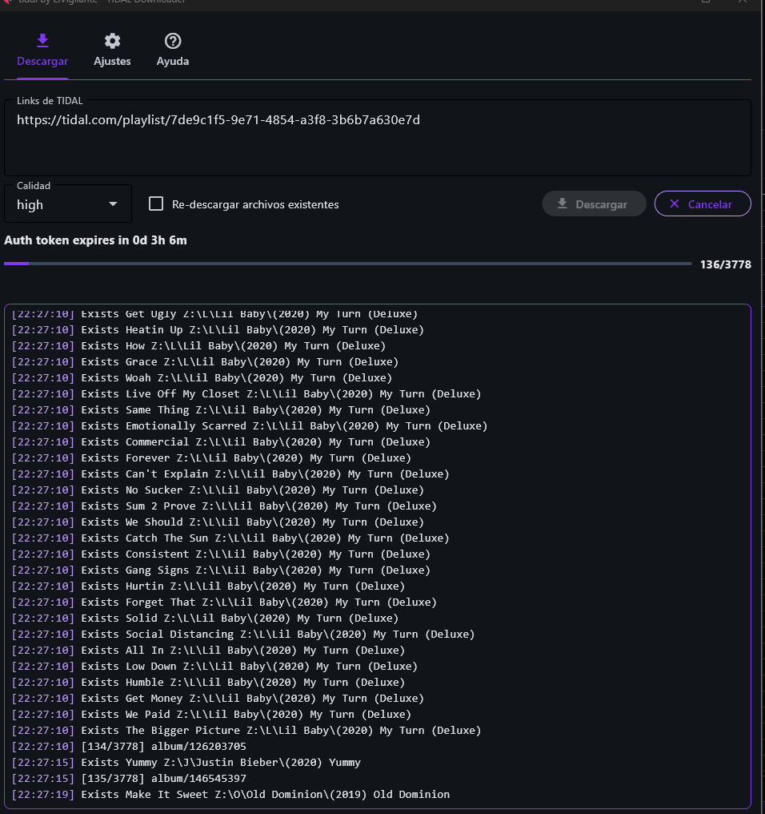
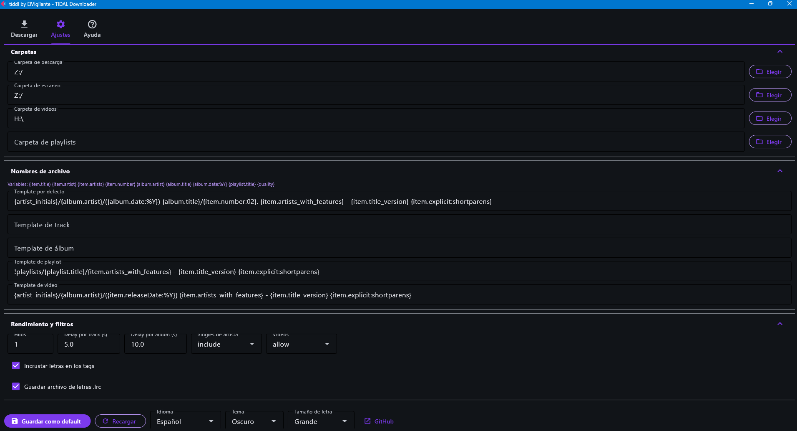
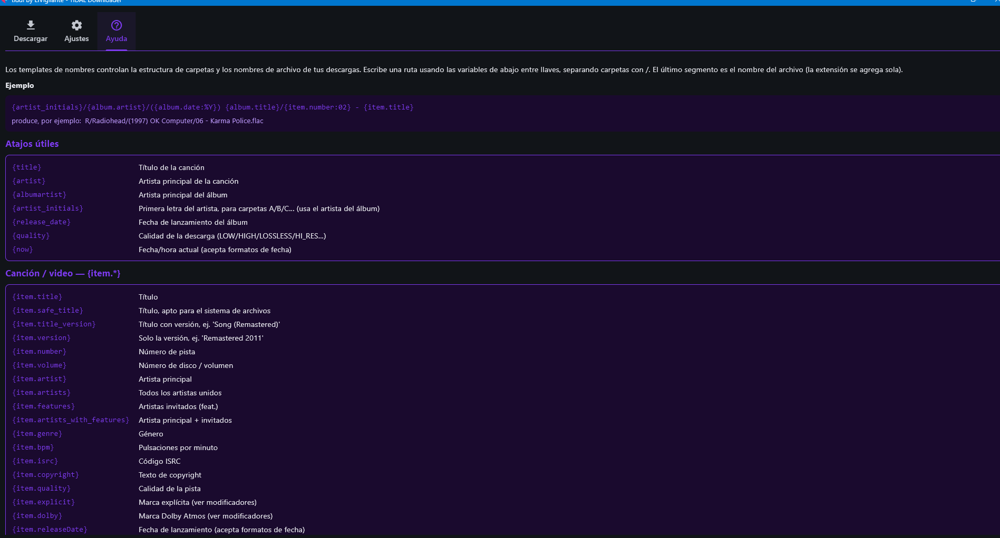
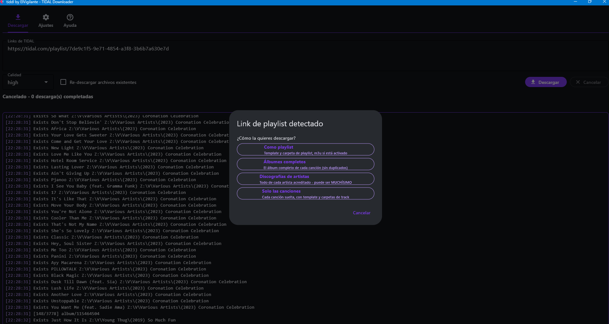

# tiddl GUI — by ElVigilante

**English** · [Español](README.es.md)

> [!WARNING]
> This app is for personal, educational, and archival purposes only. It is not affiliated with Tidal. Users must ensure their use complies with Tidal's terms of service and all applicable local copyright laws. Downloaded content is for personal use and may not be shared or redistributed. The developer assumes no responsibility for misuse of this app.

Desktop GUI for [tiddl-elvigilante](https://github.com/np3ir/tiddl-elvigilante), the production-ready TIDAL music downloader. Paste a link, pick the quality, and go — with all the power of the CLI underneath.

**Windows installer with everything bundled**: no Python, no pip, no ffmpeg to install. Download, log in with your TIDAL account, done.



## Features

- **Paste any TIDAL link** — track, album, playlist, artist or mix; hundreds at a time (long lists are split into runs automatically)
- **Smart playlist handling** — download as playlist, or expand into **full albums**, **artist discographies** or **standalone tracks** (each with its proper folder layout and templates)
- **Artist safety dialog** — confirms before massive discography downloads and lets you pick singles/videos per run
- **Live progress** — real progress bar with counter, currently-downloading track with percentage, timestamped log
- **Full settings, QBDLX-style** — download/scan/video folders, a separate **playlist folder** (another disk if you want), naming templates, threads and anti-bot delays, lyrics (embed in tags and/or `.lrc` sidecar files)
- **Built-in TIDAL login** — device-code flow straight from the app
- **English / Español**, violet dark & light themes, adjustable font size
- **Single-download lock** — multiple windows can't hammer the API at once

## Screenshots

| Settings | Help |
|---|---|
|  |  |

Smart playlist dialog — download as a playlist, or expand into albums, artist discographies or standalone tracks:



## Install (Windows)

1. Download `tiddl-ElVigilante-Setup-x.x.x.exe` from [Releases](../../releases)
2. SmartScreen will warn (unsigned installer): **More info → Run anyway**
3. Run the app → **Log in to TIDAL** → set your folders in Settings → download

Requires an active TIDAL subscription (HiFi for lossless quality).

## Install (Linux)

1. Download `tiddl-ElVigilante-x.x.x-linux-x64.tar.gz` from [Releases](../../releases) and extract it
2. Install ffmpeg from your distro (`sudo apt install ffmpeg` or equivalent)
3. Run `./tiddl-gui` → log in to TIDAL → set your folders → download

## Install (macOS)

1. Download `tiddl-ElVigilante-x.x.x-macos.dmg` from [Releases](../../releases) (Apple Silicon), open it and drag the app to Applications
2. The app is unsigned, so macOS quarantines it. If you see **"tiddl-gui is damaged and can't be opened"**, that's the quarantine flag — remove it once from Terminal:
   ```bash
   xattr -cr "/Applications/tiddl-gui.app"
   ```
3. Now open the app → log in to TIDAL → set your folders → download

To build the DMG yourself, see [BUILD_MACOS.md](BUILD_MACOS.md).

## Build from source

The GUI is a single-file [Flet](https://flet.dev) app (`main.py`) that drives the `tiddl` CLI as a subprocess — every core feature (skip database, metadata enrichment, retries, rate limiting) lives in [the CLI](https://github.com/np3ir/tiddl-elvigilante) and works unchanged.

Dev run: install the CLI, `pip install flet tomlkit`, then `python main.py`.

Full release (`release.ps1`): builds the GUI with `flet build windows`, the standalone `tiddl.exe` with PyInstaller, and the installer with Inno Setup. Read the comments in the script — several hard-won gotchas are documented there (Flutter refuses paths with special characters, PyInstaller needs rich's dynamic Unicode submodules, flet packages everything in the project folder).

## License

[MIT](LICENSE)
